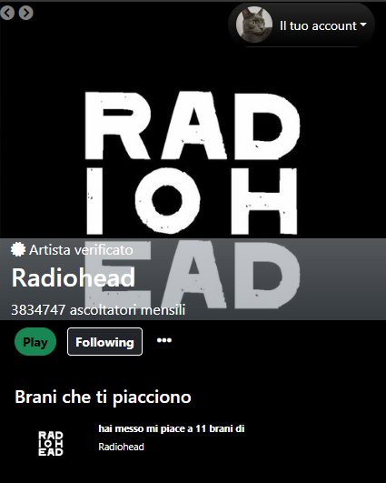

<!-- PROJECT LOGO -->
 

  <h3 align="center">Spotify Clone</h3>

    
  

<!-- ABOUT THE PROJECT -->
## About The Project

# Spotify Clone –  Vanilla Javascript 🏕️🌊

Questo è il risultato di 5 giorni di lavoro in team, durante il corso Epicode per la parte Front-end: abbiamo realizzato un clone di spotify utilizzando vanilla Javascript, Bootstrap e ci siamo appoggiati alle API di Deezer per reperire dati e brani.
L’applicazione permette di cercare artisti, album, brani e ascoltare anteprime, con un’interfaccia responsive e user-friendly. 

## 🌐 Pagine del Sito

Il sito è suddiviso varie sezioni:
- **Home Page** 
- **Artist Page** 
- **Album Page** 
- **Search Page**
- **Profile Page**

---

## 🛠️ Tecnologie Utilizzate

- **Front-End:** HTML, CSS, TypeScript, Bootstrap  
- **Testing/API:** Deezer

---

(<a href="#readme-top">back to top</a>)

<!-- GETTING STARTED -->
## Demo

Testala direttamente da qua:

https://spoti-team7-final.vercel.app/

<!-- CONTACT -->
## Contatti

Giulia Rizzo - [LinkedIn](https://www.linkedin.com/in/giulia-rizzo-rg/) - vinni2690@hotmail.com - [LinkGitHub]()
Libanio Leoncini - [LinkedIn](https://www.linkedin.com/in/libanio-leoncini/) - vinni2690@hotmail.com - [LinkGitHub]()
Vincenza Fumarulo - [LinkedIn](https://www.linkedin.com/in/vincenza-fumarulo/) - vinni2690@hotmail.com - [LinkGitHub](https://github.com/moonril/)
Luca Ferrara - [LinkedIn](https://www.linkedin.com/in/lucaferr95/) - vinni2690@hotmail.com - [LinkGitHub]()
Robero Albergo - [LinkedIn](https://www.linkedin.com/in/roberto-albergo/) - vinni2690@hotmail.com - [LinkGitHub]()
Joseline De Souza - [LinkedIn](https://www.linkedin.com/in/joseline-de-souza-1390132b0/) - vinni2690@hotmail.com - [LinkGitHub]()

**Progect Link:**
- Frontend: [https://github.com/Moonril/camping-elicriso-front-end](https://github.com/Moonril/camping-elicriso-front-end)

(<a href="#readme-top">back to top</a>)

<!-- MARKDOWN LINKS & IMAGES -->
<!-- https://www.markdownguide.org/basic-syntax/#reference-style-links -->
[contributors-shield]: https://img.shields.io/github/contributors/othneildrew/Best-README-Template.svg?style=for-the-badge
[contributors-url]: https://github.com/othneildrew/Best-README-Template/graphs/contributors
[forks-shield]: https://img.shields.io/github/forks/othneildrew/Best-README-Template.svg?style=for-the-badge
[forks-url]: https://github.com/othneildrew/Best-README-Template/network/members
[stars-shield]: https://img.shields.io/github/stars/othneildrew/Best-README-Template.svg?style=for-the-badge
[stars-url]: https://github.com/othneildrew/Best-README-Template/stargazers
[issues-shield]: https://img.shields.io/github/issues/othneildrew/Best-README-Template.svg?style=for-the-badge
[issues-url]: https://github.com/othneildrew/Best-README-Template/issues
[license-shield]: https://img.shields.io/github/license/othneildrew/Best-README-Template.svg?style=for-the-badge
[license-url]: https://github.com/othneildrew/Best-README-Template/blob/master/LICENSE.txt
[linkedin-shield]: https://img.shields.io/badge/-LinkedIn-black.svg?style=for-the-badge&logo=linkedin&colorB=555
[linkedin-url]: https://linkedin.com/in/othneildrew
[product-screenshot]: images/screenshot.png
[Next.js]: https://img.shields.io/badge/next.js-000000?style=for-the-badge&logo=nextdotjs&logoColor=white
[Next-url]: https://nextjs.org/
[React.js]: https://img.shields.io/badge/React-20232A?style=for-the-badge&logo=react&logoColor=61DAFB
[React-url]: https://reactjs.org/
[Vue.js]: https://img.shields.io/badge/Vue.js-35495E?style=for-the-badge&logo=vuedotjs&logoColor=4FC08D
[Vue-url]: https://vuejs.org/
[Angular.io]: https://img.shields.io/badge/Angular-DD0031?style=for-the-badge&logo=angular&logoColor=white
[Angular-url]: https://angular.io/
[Svelte.dev]: https://img.shields.io/badge/Svelte-4A4A55?style=for-the-badge&logo=svelte&logoColor=FF3E00
[Svelte-url]: https://svelte.dev/
[Laravel.com]: https://img.shields.io/badge/Laravel-FF2D20?style=for-the-badge&logo=laravel&logoColor=white
[Laravel-url]: https://laravel.com
[Bootstrap.com]: https://img.shields.io/badge/Bootstrap-563D7C?style=for-the-badge&logo=bootstrap&logoColor=white
[Bootstrap-url]: https://getbootstrap.com
[JQuery.com]: https://img.shields.io/badge/jQuery-0769AD?style=for-the-badge&logo=jquery&logoColor=white
[JQuery-url]: https://jquery.com 
